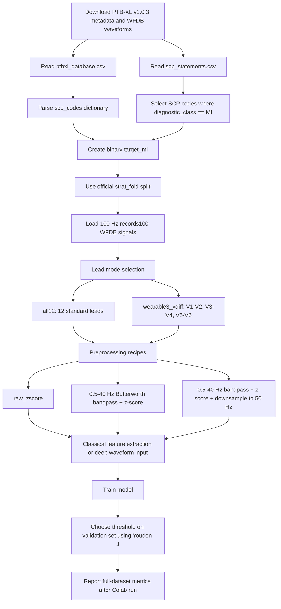

# Full-Dataset MI ECG Model Report Sections

> Scope: this document only describes the full PTB-XL v1.0.3 dataset and planned/full training configuration. It intentionally excludes local smoke-test results.

## 1. 問題背景

本專案要偵測的是 ECG 中的 myocardial infarction (MI, 心肌梗塞) 表徵。臨床上，MI 指急性心肌損傷合併心肌缺血證據；ECG 是重要證據之一，但完整診斷仍需要症狀、心肌酵素/肌鈣蛋白、影像或冠狀動脈證據共同判斷。本專案的 machine learning 任務不是直接取代臨床診斷，而是建立一個 ECG waveform-based binary classifier：

- Positive class: PTB-XL 中 `scp_statements.csv` 將 `diagnostic_class` 標為 `MI` 的紀錄。
- Negative class: 其他未含 MI diagnostic superclass 的 ECG 紀錄。
- 輸入: 10 秒、12-lead ECG waveform，或由胸前導程推導的 wearable-style 3 differential leads。
- 輸出: 該 ECG 是否呈現 MI 類別表徵的機率分數。

MI 在 ECG 上常見的線索包含：

- ST-segment elevation: 急性 MI 最常被辨識的 early sign，常出現在解剖相鄰導程。
- Reciprocal ST depression: 遠端導程 ST depression，可支持 acute infarction 判斷。
- Pathological Q waves / R wave loss: 代表心肌壞死或既往梗塞相關變化。
- T-wave changes: hyperacute T wave、T-wave inversion，會隨 MI 時間演進而變化。
- Lead-localized pattern: 不同導程群對應不同心肌區域，例如 inferior leads `II, III, aVF`、anterior/precordial leads `V1-V4`、lateral leads `I, aVL, V5-V6`。

模型利用方式：

1. 將 ECG raw waveform 做 standardized preprocessing。
2. 依 PTB-XL SCP diagnostic superclass 建立 `target_mi`。
3. 對 12 leads 或 3 differential leads 建模。
4. Classical models 使用統計/頻域 handcrafted features。
5. Deep models 直接從 waveform 或 STFT spectrogram 學習 ST-T segment、QRS morphology、T-wave morphology 與跨導程空間關係。

## 2. 資料集與欄位

主要資料集使用 PTB-XL v1.0.3。這是公開的臨床 12-lead ECG waveform dataset，專案目前以 `records100` 的 100 Hz waveform 作為預設訓練版本；每筆 ECG 長度為 10 秒，因此每筆紀錄 shape 約為 `(12 leads, 1000 samples)`。

本專案使用的完整 metadata 統計：

| Item | Value |
|---|---:|
| PTB-XL version | 1.0.3 |
| Records | 21,799 |
| Patients | 18,869 |
| Sampling rate used | 100 Hz |
| Signal length | 10 seconds |
| Leads | 12 standard leads |
| Label type | Binary MI vs non-MI |
| MI-positive records | 5,469 |
| Non-MI records | 16,330 |

主要欄位：

| 欄位 | 用途 |
|---|---|
| `ecg_id` | ECG record ID |
| `patient_id` | 病人 ID，用於 patient-stratified split |
| `age`, `sex`, `height`, `weight` | demographic metadata，不直接作為目前模型主要輸入 |
| `recording_date`, `device`, `site`, `nurse` | recording metadata |
| `report` | 原始文字報告 |
| `scp_codes` | SCP-ECG statements dictionary，例如 `{statement: likelihood}` |
| `heart_axis` | 心軸資訊 |
| `infarction_stadium1`, `infarction_stadium2` | infarction stage metadata |
| `validated_by`, `second_opinion`, `validated_by_human` | label validation metadata |
| `baseline_drift`, `static_noise`, `burst_noise` | signal quality / noise annotations |
| `electrodes_problems`, `extra_beats`, `pacemaker` | artifact / rhythm / device-related annotations |
| `strat_fold` | PTB-XL recommended fold assignment |
| `filename_lr` | 100 Hz WFDB waveform path |
| `filename_hr` | 500 Hz WFDB waveform path |

MI label 對應的 SCP codes：

| Code | Description |
|---|---|
| `ALMI` | anterolateral myocardial infarction |
| `AMI` | anterior myocardial infarction |
| `ASMI` | anteroseptal myocardial infarction |
| `ILMI` | inferolateral myocardial infarction |
| `IMI` | inferior myocardial infarction |
| `INJAL` | subendocardial injury in anterolateral leads |
| `INJAS` | subendocardial injury in anteroseptal leads |
| `INJIL` | subendocardial injury in inferolateral leads |
| `INJIN` | subendocardial injury in inferior leads |
| `INJLA` | subendocardial injury in lateral leads |
| `IPLMI` | inferoposterolateral myocardial infarction |
| `IPMI` | inferoposterior myocardial infarction |
| `LMI` | lateral myocardial infarction |
| `PMI` | posterior myocardial infarction |

資料前處理 workflow：

Lead modes:

| Lead mode | Channels | Definition | Purpose |
|---|---:|---|---|
| `all12` | 12 | `I, II, III, aVR, aVL, aVF, V1-V6` | Full diagnostic ECG baseline |
| `limb6` | 6 | limb leads only | Optional ablation |
| `precordial6` | 6 | `V1-V6` | Optional chest-lead ablation |
| `wearable3_vdiff` | 3 | `V1-V2`, `V3-V4`, `V5-V6` | Thesis-inspired wearable 3 differential chest leads |

## 3. Training / Validation / Testing 數量

本專案使用 PTB-XL 官方建議 split：

- Training: folds 1-8
- Validation: fold 9
- Testing: fold 10

完整資料集 split 統計如下：

| Split | Folds | Records | Patients | MI positive | Non-MI | MI ratio |
|---|---|---:|---:|---:|---:|---:|
| Training | 1-8 | 17,418 | 15,023 | 4,379 | 13,039 | 25.14% |
| Validation | 9 | 2,183 | 1,942 | 540 | 1,643 | 24.74% |
| Testing | 10 | 2,198 | 1,904 | 550 | 1,648 | 25.02% |
| Total | 1-10 | 21,799 | 18,869 | 5,469 | 16,330 | 25.09% |

## 4. Challenge

主要挑戰如下：

1. Label noise and task definition: PTB-XL label 來自 ECG SCP statements，模型學到的是 ECG 上的 MI 表徵，不等同完整臨床 MI 診斷。
2. Multi-label nature: 同一筆 ECG 可能同時有 MI、STTC、CD、HYP 等 superclass，binary MI 任務會把共病樣態壓成單一 positive/negative label。
3. Class imbalance: MI positive 約 25%，non-MI 約 75%，需要 class weighting、validation threshold tuning，以及 AUROC/AUPRC/sensitivity/specificity 等多指標觀察。
4. Morphology is localized and time-dependent: ST elevation、T inversion、Q waves 可能因 infarct location 和發病時間不同而呈現不同型態。
5. Limited-lead deployment gap: 12-lead ECG 訊息完整，但 wearable 3 differential leads 可能失去 limb-lead 或 posterior/lateral localization clues。
6. Signal artifacts: baseline drift、static noise、burst noise、電極問題、pacemaker pattern 都可能影響 ST segment 和 QRS/T morphology。
7. External validity: PTB-XL 來源單一，未必完全代表公司裝置、Mi ECG 或真實 wearable data distribution。

## 5. 模型總表

| Family | Model | Input | Purpose |
|---|---|---|---|
| Classical | Logistic Regression | handcrafted global waveform features | Fast linear baseline, interpretable directionality |
| Classical | Random Forest | handcrafted global waveform features | Nonlinear tree baseline, robust to feature scaling |
| Classical | HistGradientBoosting | handcrafted global waveform features | Strong tabular baseline |
| Deep | ResNet1D | ECG waveform tensor | Main 1D CNN baseline for morphology learning |
| Deep | Inception1D | ECG waveform tensor | Multi-kernel temporal receptive fields |
| Deep | Spectrogram2DNet | STFT amplitude + phase image tensor | Thesis-inspired time-frequency CNN, especially for limited leads |

Full planned experiment matrix:

| Lead mode | Preprocessing | Models |
|---|---|---|
| `all12` | `raw_zscore`, `bandpass_0.5_40_zscore`, `bandpass_0.5_40_zscore_downsample50` | Logistic Regression, Random Forest, HistGradientBoosting |
| `wearable3_vdiff` | `raw_zscore`, `bandpass_0.5_40_zscore` | Logistic Regression, Random Forest, HistGradientBoosting |
| `all12` | `raw_zscore`, `bandpass_0.5_40_zscore` | ResNet1D, Inception1D |
| `wearable3_vdiff` | `bandpass_0.5_40_zscore` | ResNet1D, Inception1D, Spectrogram2DNet |

## 6. 模型設定總表

Colab full run 完成後，`training_time`, `epochs_run`, validation/test metrics 可以直接從 `reports/metrics_deep.csv` 和 `reports/metrics_classical.csv` 補上。下面先列出目前固定的 formal training configuration。

| Framework | Model | model_name | Lead | Sampling rate | Input shape | Epochs | Learning rate | Weight decay | Batch size | Parameters / capacity | Training time |
|---|---|---|---|---:|---|---:|---:|---:|---:|---:|---|
| scikit-learn | Logistic Regression | `logistic_regression` | `all12` | 100 Hz / 50 Hz | 156 features for 12 leads | N/A | N/A | L2 default | N/A | 157 learned coefficients incl. intercept | Fill after full run |
| scikit-learn | Logistic Regression | `logistic_regression` | `wearable3_vdiff` | 100 Hz | 39 features for 3 leads | N/A | N/A | L2 default | N/A | 40 learned coefficients incl. intercept | Fill after full run |
| scikit-learn | Random Forest | `random_forest` | `all12`, `wearable3_vdiff` | 100 Hz / 50 Hz | global features | N/A | N/A | N/A | N/A | 400 trees, `min_samples_leaf=3`, balanced subsample | Fill after full run |
| scikit-learn | HistGradientBoosting | `hist_gradient_boosting` | `all12`, `wearable3_vdiff` | 100 Hz / 50 Hz | global features | N/A | 0.04 | `l2_regularization=0.01` | N/A | 250 boosting iterations max, early stopping | Fill after full run |
| PyTorch | 1D Residual CNN | `resnet1d` | `all12` | 100 Hz | `(12, 1000)` | 20 requested | 0.001 | 0.0001 | 128 | 2,121,345 trainable params | Fill after Colab |
| PyTorch | 1D Residual CNN | `resnet1d` | `wearable3_vdiff` | 100 Hz | `(3, 1000)` | 20 requested | 0.001 | 0.0001 | 128 | 2,112,705 trainable params | Fill after Colab |
| PyTorch | Inception-style 1D CNN | `inception1d` | `all12` | 100 Hz | `(12, 1000)` | 20 requested | 0.001 | 0.0001 | 128 | 334,865 trainable params | Fill after Colab |
| PyTorch | Inception-style 1D CNN | `inception1d` | `wearable3_vdiff` | 100 Hz | `(3, 1000)` | 20 requested | 0.001 | 0.0001 | 128 | 315,146 trainable params | Fill after Colab |
| PyTorch | STFT 2D CNN | `spectrogram2d` | `wearable3_vdiff` | 100 Hz | amplitude + phase STFT, 6 channels | 20 requested | 0.001 | 0.0001 | 128 | 587,713 trainable params | Fill after Colab |

Deep-learning shared training details:

- Optimizer: AdamW
- Loss: `BCEWithLogitsLoss`
- Imbalance handling: `pos_weight` from training-set class weights
- Early stopping: validation AUROC, patience = 5
- Threshold selection: Youden J statistic on validation set
- Device: CUDA/T4 preferred for full deep training
- Random seed: 42

## 7. 遇到的 Challenge

Implementation / engineering challenges:

1. Full PTB-XL waveform download is large. PhysioNet v1.0.3 uncompressed size is around GB scale, so Colab runtime needs persistent Drive storage and resumable download.
2. Colab runtime resets when switching GPU. The notebook should mount Drive, install requirements, verify project files, then run deep-learning cells after selecting T4 GPU.
3. Local CPU is enough for metadata parsing and classical baselines, but full deep learning should run on T4 GPU or better.
4. Public GitHub should not include raw ECG waveform data. The repository therefore excludes `data/` and relies on reproducible download scripts/notebook.
5. Full metrics are not finalized until Colab finishes all deep-learning runs. The report should separate fixed methodology from post-training results.
6. Wearable-style 3-lead mode is derived from PTB-XL 12-lead ECG, not captured by the exact target hardware; final Mi ECG deployment still needs company-device validation.
7. Threshold tuning can strongly affect sensitivity/specificity. For clinical screening, the operating point should be selected based on validation-set sensitivity target, not only highest accuracy.

## Sources

- PTB-XL v1.0.3 PhysioNet: https://physionet.org/content/ptb-xl/1.0.3/
- PTB-XL Scientific Data paper: https://www.nature.com/articles/s41597-020-0495-6
- Acute MI ECG evolution/features: https://pmc.ncbi.nlm.nih.gov/articles/PMC1122768/
- Fourth Universal Definition of MI: https://www.ahajournals.org/doi/10.1161/CIR.0000000000000617
